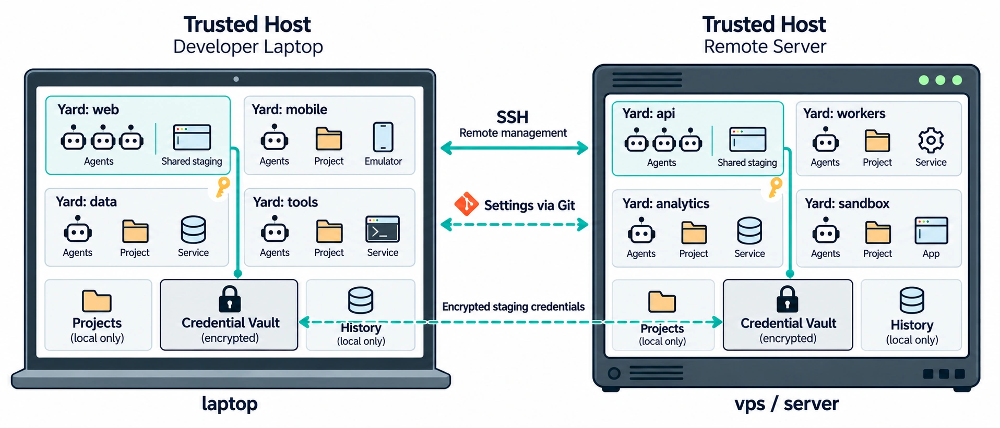

# Subyard

> Give agents a yard, not the house keys.

Give AI coding agents isolated **yards** across your laptop, servers, and VPSs.
Each yard keeps projects and sessions, and can host shared service environments
where agents run your product, reproduce bugs, and verify changes.

[Get started](#getting-started) · [Documentation](docs/README.md) · [Security](docs/security.md)



## What you get

- **Your agents and editors.** Claude Code, Codex, OpenCode, pi; VS Code,
  [Orca](docs/orca.md), shell, and optional desktop ADE. Orca includes a ready-made
  profile and background service; enable it on demand with `yard orca up`.
- **Multiple yards per machine.** Container or VM isolation, Debian/Ubuntu system
  images, and per-yard CPU/RAM limits.
- **Profiles for your product.** Reusable toolchains, dependencies, caches, and
  service environments for each task.
- **Shared staging inside a yard.** Agents can run services, reproduce issues,
  inspect behavior, and test changes end to end on your own compute.
- **Resources on demand.** Use shared environments or
  [broker-leased test VMs](docs/test-vms.md) for checks that need their own machines,
  root access, or reboots. Reuse in local compute.
- **Connected machines.** Manage yards locally or on remote hosts over SSH; sync shared
  settings through Git. [Multi-host setup →](docs/workflows.md#select-local-and-remote-yards)
- **Encrypted staging credentials.** Sync selected staging/QA records between
  trusted hosts; deliver only authorized files to yards. [Credential sync →](docs/keys.md)
- **Persistent history and statistics.** Keep agent sessions, projects, and caches.
  [AI Observer](docs/ai-observer.md) tracks Claude Code and Codex session usage.

## Getting started

You need a **GNU/Linux host** — laptop, workstation, or server; `yard init` installs
Incus for you. Native Windows/macOS support isn't planned — run Subyard inside a
Linux VM and follow the steps below.

[Host requirements and installation details →](docs/getting-started.md)

```bash
curl -fsSL --proto '=https' --tlsv1.2 \
  https://github.com/Subyard/Subyard/releases/latest/download/subyard-install.sh | bash
exec "$SHELL" -l
```

Create a yard and open a project:

```bash
yard init
yard sync --name demo ./my-project
yard code demo
```

This copies the project into the yard and opens VS Code. Use `yard shell demo`
for a terminal. Connect another prepared host with:

```bash
yard host add me@my-server
yard yards
```

[Profiles, remote projects, and dashboards →](docs/workflows.md)

## The host stays yours

Unprivileged Incus containers are the default; managed configuration rejects host
Docker/Incus control sockets. `yard bind` and SSH grants explicitly widen access. Containers
share the host kernel; agents in one yard share its trust and granted credentials.
Run `yard security` to [audit the boundary](docs/security.md).

[Contribute](docs/development.md) · [MIT license](LICENSE)
